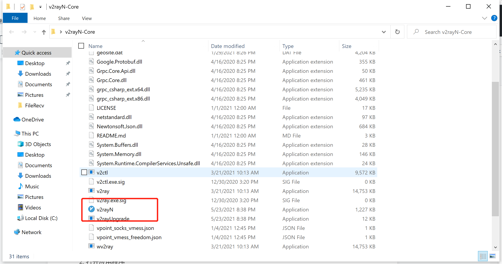
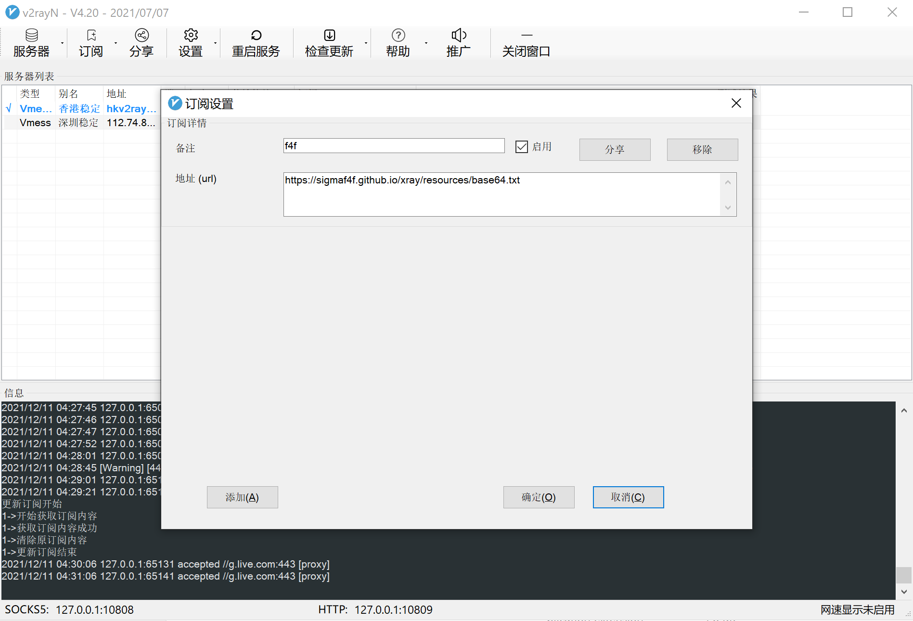

# Windows 客户端设定

# 1.下载V2rayN

> 这是下载地址 https://github.com/2dust/v2rayN 下载最新版本

> 如果无法打开gihub，[点击这里下载](https://sigmaf4f.github.io/xray/resources/v2rayN-Core.zip)

# 2.打开应用程序

# 3.点击订阅

# 4.选择自动配置系统代理

